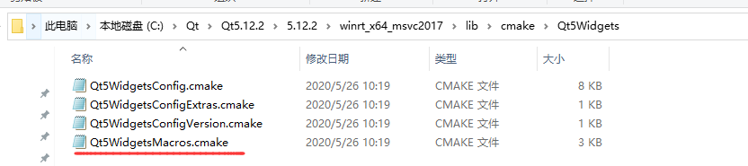
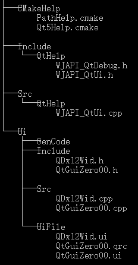
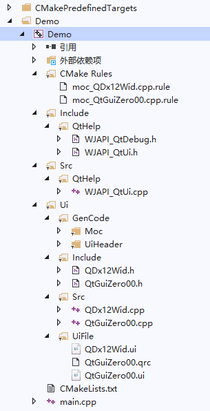

# Cmake2VsIDE_Qt
Map the file tree into the IDE

## Source Code Path


## How to Use
```CMake
QT5_WRAP_UI_DIY(genheader UIDIR "${CMAKE_CURRENT_LIST_DIR}/Ui/UiFile" OUTDIR "${CMAKE_CURRENT_LIST_DIR}/Ui/GenCode/UiHeader")
list(APPEND libcode ${genheader})
QT5_WRAP_CPP_DIY(genmoc HEADERDIR "${CMAKE_CURRENT_LIST_DIR}/Ui/Include" OUTDIR "${CMAKE_CURRENT_LIST_DIR}/Ui/GenCode/Moc")
list(APPEND libcode ${genmoc})
source_group("/Ui/GenCode/UiHeader" FILES ${genheader})
source_group("/Ui/GenCode/Moc" FILES ${genmoc})
```
## Picture



